# Solana Escrow Program

A trustless, peer‑to‑peer token escrow built on Solana devnet, with a React/TypeScript frontend and an Anchor-based smart contract. Users can create offers to swap one SPL token for another, take existing offers, or revoke their own offers without any centralized intermediary.

> **📚 Comprehensive Documentation:** For detailed architecture diagrams, transaction flows, and component breakdowns, see the [DeepWiki Documentation](https://deepwiki.com/akash-R-A-J/solana-escrow-program)

---

## Features

- **Trustless SPL token swaps** using a Solana program deployed on devnet
- **Create, take, and revoke** escrow offers with a clean React UI
- **Program Derived Addresses (PDAs)** for deterministic offer and vault accounts
- **Wallet adapter integration** (Phantom, Solflare, etc.) for signing and sending transactions
- **Type-safe integration** via Anchor IDL and modern Vite/TypeScript frontend tooling

---

## Architecture

The system has three main layers:

### Frontend dApp
React + TypeScript single‑page application that handles:
- Wallet connection and gating of authenticated actions
- Creating offers, listing all offers, and managing "My Offers"
- Calling blockchain operations via a `useEscrow` hook

### Integration Layer
A set of hooks and services that bridge the UI and Solana:
- `@coral-xyz/anchor` for type-safe program interaction using the IDL
- `@solana/web3.js` for RPC communication and transaction sending
- `@solana/spl-token` for SPL token account operations
- `@solana/wallet-adapter-*` packages for wallet connectivity and signing

### On‑chain Program (Escrow)
An Anchor-based Solana program (deployed on devnet) that:
- Manages escrowed token custody in a vault PDA
- Tracks offer metadata in an offer PDA
- Executes atomic swaps and cleans up accounts

**Program address (devnet):** `6kTpPk3Bm4SfY2KuLF5sH4cpsTwBUtyJ5j3prMB92i7Q`

---

### Visual Architecture

The following diagram illustrates the complete system architecture, showing all layers from the user interface down to the Solana blockchain:

```mermaid
graph TB
    subgraph "User Interface Layer"
        Browser["Web Browser"]
    end
    
    subgraph "Frontend Application"
        App["App.tsx<br/>Main Component"]
        Header["Header Component"]
        CreateOffer["CreateOffer Component"]
        OffersList["OffersList Component"]
        MyOffers["MyOffers Component"]
        Hook["useEscrow Hook"]
    end
    
    subgraph "Integration Layer"
        Anchor["@coral-xyz/anchor<br/>Program Interface"]
        Web3["@solana/web3.js<br/>Connection & Transactions"]
        SPL["@solana/spl-token<br/>Token Operations"]
        Wallet["@solana/wallet-adapter-*<br/>react<br/>WalletProvider"]
    end
    
    subgraph "Solana Devnet"
        RPC["RPC Endpoint"]
        Program["Escrow Program<br/>6kTpPk3Bm4SfY2KuLF5sH4cpsTwBUtyJ5j3prMB92i7Q"]
        OfferPDAs["Offer PDAs<br/>Derived from 'offer' + id"]
        VaultPDAs["Vault PDAs<br/>Associated Token Accounts"]
        SystemProg["System Program"]
        TokenProg["SPL Token Program"]
    end
    
    Browser --> App
    App --> Header
    App --> CreateOffer
    App --> OffersList
    App --> MyOffers
    
    CreateOffer --> Hook
    OffersList --> Hook
    MyOffers --> Hook
    
    Hook --> Anchor
    Hook --> Web3
    Hook --> SPL
    App --> Wallet
    
    Anchor --> RPC
    Web3 --> RPC
    SPL --> RPC
    Wallet -.-> Browser
    
    RPC --> Program
    Program --> OfferPDAs
    Program --> VaultPDAs
    Program --> SystemProg
    Program --> TokenProg
```Architecture Diagram](https://deepwiki.com/akash-R-A-J/solana-escrow-program) in the DeepWiki documentation. The diagram illustrates:

- Complete data flow from user interface to blockchain
- Integration between React components and Solana program
- PDA derivation patterns and account relationships
- RPC communication and transaction lifecycle

## Smart Contract Design

### Accounts

The program uses deterministic PDAs for offers and token vaults:

#### Offer PDA
- **Seeds:** `["offer", id: u64]`
- **Fields:**
  - `id: u64` (timestamp-based identifier)
  - `offer_maker: Pubkey`
  - `token_mint_a: Pubkey`
  - `token_mint_b: Pubkey`
  - `token_b_demanded_amount: u64`
  - `bump: u8`

#### Vault PDA
- **Type:** Associated Token Account (ATA)
- **Seeds:** `[offer_pubkey, token_program, token_mint_a]`
- Holds escrowed Token A for the lifetime of the offer

This structure allows the frontend to derive and verify addresses off‑chain while the program enforces them on‑chain.

### Instructions

The program exposes three core instructions:

#### `make_offer`
- Creates the offer PDA
- Creates/derives the vault ATA for Token A
- Transfers Token A from the maker into the vault

#### `take_offer`
- Transfers Token B from the taker to the maker
- Transfers Token A from the vault to the taker
- Closes the offer and vault accounts

#### `revoke_offer`
- Verifies the signer is the original maker
- Returns escrowed Token A from the vault to the maker
- Closes the offer and vault accounts

All operations are atomic and governed by PDAs plus signer checks, removing counterparty risk in the swap.

---

## Frontend Application

The frontend is a Vite‑powered React app written in TypeScript.

### Key Components

- **App:** Main orchestrator, manages tab navigation (`Create Offer`, `All Offers`, `My Offers`), wallet connection gating, and a `refreshTrigger` mechanism to refetch on‑chain state after actions

- **Header:** Displays branding and uses `WalletMultiButton` from `@solana/wallet-adapter-react-ui` for wallet connection

- **CreateOffer:** Form for creating a new offer with Token A/B selection, amount inputs, and submission via the `useEscrow.makeOffer` hook

- **OffersList:** Lists all open offers and exposes a "Take" action that opens the `TakeOfferModal`

- **MyOffers:** Filters offers by the connected wallet's public key and allows the maker to revoke offers

- **OfferCard:** Reusable UI card for displaying offer details (maker, tokens, amounts, status)

- **TakeOfferModal:** Confirmation dialog for taking an offer, includes balance validation on the taker's Token B account and feedback on loading/error states

### State Management & Data Flow

- Local React state for UI concerns (forms, loading, errors)
- A custom `useEscrow` hook that:
  - Reads the connected wallet and IDL types
  - Builds Anchor transactions (`make_offer`, `take_offer`, `revoke_offer`)
  - Sends and confirms transactions via RPC
- A `refreshTrigger` state value in `App` that increments on successful transactions and triggers data refetch for dependent components

---

## Technology Stack

### Frontend
- **React** `^19.2.0` – component-based UI
- **TypeScript** `~5.9.3` – type safety and better tooling
- **Vite** `^7.2.4` – fast dev server and build system
- **ESLint** `^9.39.1` – linting and code quality

### Solana / Web3
- `@coral-xyz/anchor` – IDL-driven program interface
- `@solana/web3.js` – RPC and transaction utilities
- `@solana/spl-token` – SPL token account management
- `@solana/wallet-adapter-react`, `react-ui`, `wallets` – wallet connection and UI
- `bn.js` – big integer math for token amounts

---

## Getting Started

### Prerequisites

- Node.js (LTS recommended)
- Yarn or npm
- A Solana wallet (Phantom, Solflare, etc.) funded on **devnet**
- Solana CLI and Anchor (optional, if you want to build/deploy the program yourself)

### Frontend Setup

```bash
git clone https://github.com/akash-R-A-J/solana-escrow-program.git
cd solana-escrow-program/frontend

# install dependencies
yarn            # or: npm install

# start dev server
yarn dev        # or: npm run dev
```

The app will start on the Vite dev server (e.g. `http://localhost:5173`). Connect a devnet wallet and you should see your offers and the global offers list.

### Building & Preview

```bash
# build production bundle
yarn build      # or: npm run build

# preview production build locally
yarn preview    # or: npm run preview
```

### Program Deployment (Optional)

The repository currently targets the devnet program at:

```
6kTpPk3Bm4SfY2KuLF5sH4cpsTwBUtyJ5j3prMB92i7Q
```

To deploy your own instance:

1. Install Anchor and Solana CLI
2. Configure Solana to use devnet (`solana config set --url https://api.devnet.solana.com`)
3. Build and deploy the program from the `programs` directory
4. Update the program ID and IDL reference in the frontend (`frontend/src/idl/escrow.json` and any config)

---

## Development Guide

The project uses standard scripts defined in `frontend/package.json`:

## Transaction Flows

The following sequence diagrams illustrate the complete data flow for each transaction type, from user interaction through component validation, hook orchestration, and on-chain execution.

### Make Offer Flow

```mermaid
sequenceDiagram
    actor User
    participant CreateOffer as CreateOffer Component
    participant Hook as useEscrow Hook
    participant Service as EscrowService
    participant RPC as Solana RPC
    participant Chain as On-Chain Program
    
    User->>CreateOffer: Select tokens & amounts
    CreateOffer->>CreateOffer: Validate inputs
    CreateOffer->>Hook: makeOffer()
    Hook->>Hook: generateOfferId()
    Hook->>Hook: validateOfferParams()
    Hook->>Service: makeOffer(params)
    Service->>RPC: Build & send transaction
    RPC->>Chain: Create Offer PDA
    RPC->>Chain: Create Vault PDA
    RPC->>Chain: Transfer Token A → Vault
    Chain-->>RPC: Transaction signature
    RPC-->>Service: txSignature
    Service-->>Hook: {txSignature, offerId}
    Hook-->>CreateOffer: Success
    CreateOffer->>CreateOffer: Reset form
    CreateOffer->>User: Show success message
```



### Take Offer Flow

```mermaid
sequenceDiagram
    actor User
    participant OffersList as OffersList Component
    participant Modal as TakeOfferModal
    participant Hook as useEscrow Hook
    participant Service as EscrowService
    participant RPC as Solana RPC
    participant Chain as On-Chain Program
    
    User->>OffersList: Browse offers
    OffersList->>Hook: getAllOffers()
    Hook-->>OffersList: Display offers
    User->>OffersList: Click 'Take Offer'
    OffersList->>Modal: Open modal
    Modal->>Hook: getTokenBalance(tokenB)
    Hook-->>Modal: Display balance
    User->>Modal: Confirm
    Modal->>Hook: takeOffer(offer)
    Hook->>Service: takeOffer(params)
    Service->>RPC: Build & send transaction
    RPC->>Chain: Transfer Token B → Maker
    RPC->>Chain: Transfer Token A → Taker
    RPC->>Chain: Close Vault & Offer
    Chain-->>RPC: Transaction signature
    RPC-->>Service: txSignature
    Service-->>Hook: txSignature
    Hook-->>Modal: Success
    Modal->>User: Show success & refresh
```



### Revoke Offer Flow

```mermaid
sequenceDiagram
    actor User
    participant MyOffers as MyOffers Component
    participant Hook as useEscrow Hook
    participant Service as EscrowService
    participant RPC as Solana RPC
    participant Chain as On-Chain Program
    
    User->>MyOffers: View 'My Offers'
    MyOffers->>Hook: getOffersByMaker()
    Hook-->>MyOffers: Display user's offers
    User->>MyOffers: Click 'Revoke'
    MyOffers->>MyOffers: Confirm dialog
    User->>MyOffers: Confirm revocation
    MyOffers->>Hook: revokeOffer(offer)
    Hook->>Hook: Verify ownership
    Hook->>Service: revokeOffer(params)
    Service->>RPC: Build & send transaction
    RPC->>Chain: Transfer Token A → Maker
    RPC->>Chain: Close Vault & Offer
    Chain-->>RPC: Transaction signature
    RPC-->>Service: txSignature
    Service-->>Hook: txSignature
    Hook-->>MyOffers: Success
    MyOffers->>User: Show success & refresh
```user input through component validation, hook orchestration, and on-chain account creation
- **[Take Offer Flow](https://deepwiki.com/akash-R-A-J/solana-escrow-program/2.2-transaction-flows#take-offer-flow)** - Offer discovery, balance verification, and atomic token swap execution
- **[Revoke Offer Flow](https://deepwiki.com/akash-R-A-J/solana-escrow-program/2.2-transaction-flows#revoke-offer-flow)** - Authorization checks and token refund process

Each flow diagram shows the complete data path from React components through the `useEscrow` hook, `EscrowService` abstraction, Solana RPC, and finally to on-chain execution.

---

```json
{
  "scripts": {
    "dev": "vite",
    "build": "tsc && vite build",
    "lint": "eslint src --ext ts,tsx",
    "preview": "vite preview"
  }
}
```

Typical workflow:

1. Run `yarn dev` for hot-reload development
2. Use `yarn lint` to catch issues early
3. Build and preview with `yarn build` and `yarn preview` before deployment

---

## Future Improvements

Some potential extensions to this project:

- **Unit and integration tests** for the on‑chain program and the `useEscrow` hook
- **Price/quote integration** (e.g., Pyth or Switchboard) to show approximate USD values
- **Order filtering and sorting** (by token, amount, recency)
- **Mainnet‑beta configuration** with environment-based RPC and program IDs
- **Notification/toast system** for transaction lifecycle feedback
- **Enhanced error handling** with user-friendly messages for common failure scenarios
- **Token decimals handling** with explicit validation and display

---

## Project Structure

```
solana-escrow-program/
├── frontend/               # React + TypeScript dApp
│   ├── src/
│   │   ├── components/    # UI components
│   │   ├── hooks/         # Custom hooks (useEscrow)
│   │   ├── idl/           # Anchor IDL
│   │   └── App.tsx        # Main app component
│   └── package.json
├── programs/              # Anchor smart contract
│   └── escrow/
│       └── src/
│           └── lib.rs     # Program logic
└── README.md
```

---

## Contributing

Contributions are welcome! Feel free to:

- Open issues for bugs or feature requests
- Submit pull requests with improvements
- Share feedback and suggestions

---

## License

MIT License - feel free to use this project for learning or building your own escrow solutions.

---

## Contact

Built by [akash-R-A-J](https://github.com/akash-R-A-J)

For questions or collaboration opportunities, feel free to reach out via GitHub.
